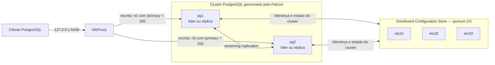

# Lab 05: Failover automático

Este lab evolui o cenário de replicação com **PostgreSQL 16 + Patroni + etcd + HAProxy**. A base de e-commerce dos labs anteriores é inicializada em volumes próprios. O objetivo é interromper abruptamente o líder, observar a promoção automática e voltar a escrever usando o mesmo endereço.

## Arquitetura



`pg1` e `pg2` são identidades, não papéis fixos. O Patroni coordena a liderança pelo etcd e gerencia o PostgreSQL. O HAProxy consulta `/primary` na API do Patroni para encaminhar novas conexões ao líder. A replicação é **assíncrona**.

Somente a porta de escrita é publicada, em loopback. APIs administrativas e etcd ficam na rede do Compose. Não são usados containers nem volumes dos outros labs.

## Executar

Pré-requisitos: Docker com Compose, Bash, acesso à internet no primeiro build e recursos para sete containers leves. Execute a partir deste diretório:

```bash
cp .env.example .env
# Substitua as três senhas de exemplo; preserve um .env já existente.
docker compose build
docker compose up -d --wait --wait-timeout 240
bash scripts/check.sh
bash scripts/status.sh
bash scripts/failover_demo.sh
```

O banco é `appdb`, o superusuário é `postgres` e a role de replicação é `replicator`. As roles de aplicação mantêm as credenciais didáticas dos labs anteriores. Alterar `.env` não altera senhas já gravadas no banco.

A imagem instala Patroni 4.1.0 sobre `postgres:16-bookworm`; etcd usa 3.5.21 e HAProxy a linha 3.0. Tags de PostgreSQL/HAProxy e dependências Python podem receber atualizações; não há promessa de build idêntico byte a byte.

## Roteiro de falha e evidências

`failover_demo.sh` executa:

1. Validação do líder, réplica read-only, streaming assíncrono, dados, endpoint e saúde dos três nós etcd.
2. Escrita de uma sentinela pelo HAProxy e espera explícita do replay na réplica.
3. `SIGKILL` no container líder, sem promoção manual. O restart automático está desabilitado para manter a falha até a recuperação medida.
4. Tentativas de escrita pelo mesmo endpoint, com limite de tentativas e timeout de conexão/consulta.
5. Confirmação do novo líder e das sentinelas anterior e posterior à falha.
6. Reinício do antigo líder, espera de sua reintegração como réplica e nova validação.

Cada execução grava `evidence/<UTC>_<id>.txt` e logs dos containers. As sentinelas do cenário permanecem em `audit.failover_probe` para investigação; as do check são removidas. Não execute demonstrações concorrentes nem altere os dados durante o check. Em caso de erro ou interrupção, o script tenta religar o nó derrubado; isso não garante recuperação se houver outra falha.

`write_recovery_seconds` mede do início da interrupção até a primeira nova escrita confirmada, com resolução de segundos, incluindo a execução do comando Docker e as tentativas de reconexão. É uma observação local, não um SLA ou medição universal de RTO. A sentinela anterior é deliberadamente reproduzida antes da falha: sua preservação **não comprova RPO zero**.

## Inspeção

```bash
# Cliente pelo mesmo endpoint usado pela demonstração:
docker compose exec client psql
# Estado do cluster:
docker compose exec client patronictl -c /etc/patroni.yml list
# Consulta direta a um membro:
docker compose exec pg1 psql -U postgres -d appdb \
  -c 'SELECT pg_is_in_recovery();'
# Logs de eleição, promoção e retorno:
docker compose logs pg1 pg2 haproxy
```

O healthcheck `/health` comprova PostgreSQL disponível, mas não prova replicação nem roteamento de escrita; use `check.sh`. O bootstrap usa callback do Patroni e executa os arquivos `init/` apenas na criação do cluster. Não utiliza o entrypoint de inicialização da imagem oficial PostgreSQL.

## Decisões e limites

- `ttl=20`, `loop_wait=3` e `retry_timeout=3` controlam detecção e renovação da liderança; HAProxy também leva tempo para atualizar o backend. Sessões e transações em andamento podem falhar e a aplicação precisa reconectar. Um commit com resposta perdida exige reconciliação/idempotência; a sentinela usa chave única e `ON CONFLICT`.
- `maximum_lag_on_failover=1MiB` limita a elegibilidade com base no estado observado; não garante um teto exato para perda de commits. Escritas ainda não replicadas podem desaparecer. Replicação não substitui backup.
- Checksums e `wal_log_hints` permitem `pg_rewind` no retorno de um nó divergente. Se o WAL necessário não existir, pode ser preciso reconstruir a réplica; o lab não habilita exclusão automática do diretório de dados após falha de rewind.
- Três membros etcd suportam a perda de um membro. A demonstração automatizada cobre a queda do líder PostgreSQL, não partições de rede, perda de quorum ou fencing. Sem quorum, não se deve esperar eleição segura de um novo líder.
- Um único host Docker e um único HAProxy continuam sendo pontos únicos de falha. Esta topologia exercita o mecanismo de HA; não entrega tolerância à perda do host.
- etcd e a API Patroni não usam TLS/autenticação neste ambiente local. Não publique essas portas nem use esta configuração diretamente em produção. O socket Unix usa trust apenas dentro do container; conexões TCP PostgreSQL usam SCRAM.
- Configurações em `bootstrap.dcs` só são aplicadas na criação do cluster. Para um cluster existente, use `patronictl edit-config`.

## Parar e retomar

```bash
docker compose stop
docker compose up -d --wait --wait-timeout 240
bash scripts/check.sh
```

Para apagar **todos os dados somente deste lab**, incluindo o estado do etcd:

```bash
docker compose down -v
docker compose up -d --wait --wait-timeout 240
```

Não apague isoladamente os volumes etcd mantendo os dados PostgreSQL. Não promova manualmente um membro fora do Patroni.

## Material para o post

Use as evidências reais de `evidence/` para mostrar: topologia inicial; ausência de failover no Lab 04; eleição e troca de timeline; tempo observado até escrita; identidade do novo líder; antigo líder reintegrado; limites de RPO, reconexão e pontos únicos de falha. O post será desenvolvido depois da implementação.

## Validação

Implementado e validado automaticamente em 25–26/09/2026. Três quedas controladas retomaram a escrita em **19–24 s**, incluindo uma execução após bootstrap completo com volumes novos. Consulte [o registro de validação](evidence/validation.md) para condições e evidências.

## Referências

- [Configuração e bootstrap do Patroni](https://patroni.readthedocs.io/en/latest/yaml_configuration.html)
- [Healthchecks da API Patroni](https://patroni.readthedocs.io/en/latest/rest_api.html)
- [Modos de replicação e limites de perda de dados](https://patroni.readthedocs.io/en/latest/replication_modes.html)
- [etcd em containers](https://etcd.io/docs/v3.5/op-guide/container/)
